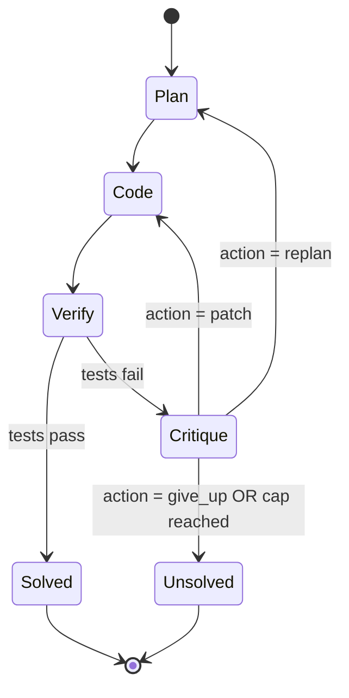

# Quorum — Agent Society Build Spec
### Qwen Cloud Global AI Hackathon — Track 3: Agent Society

This file is the source of truth for building **Quorum**: a multi-agent system that solves
competitive-programming problems through role-based collaboration (Planner / Coder / Verifier /
Critic), benchmarked head-to-head against a single-agent Qwen baseline with the same retry budget.
The benchmark *is* the product's core feature, not an afterthought — Track 3 explicitly judges on
"a measurable efficiency gain over single-agent baselines," so the comparison engine gets first-class
treatment in the architecture, not a script bolted on at the end.

Deadline: **Jul 9, 2026, 2:00pm PDT**. Submission needs: public repo + OSS license, proof of
Alibaba Cloud deployment, architecture diagram, ≤3min demo video, text description, track ID.

---

## 0. Non-Negotiable Rules

These are hard constraints. Do not relax them for convenience mid-build.

1. **Baseline fairness.** The single-agent baseline gets the *exact same* retry budget, sandbox
   access, and problem set as Quorum's multi-agent loop. The only independent variable is whether
   reasoning is split across roles. If this isn't true, the efficiency-gain claim is invalid and the
   whole submission's core feature is unsupportable — don't let scope-cutting erode this.
2. **Sandbox isolation.** Generated code never executes in the orchestrator's process and never gets
   network access. It only runs through the sandbox runner, under a hard timeout (8s) and memory cap.
   No exceptions, even for "trusted" test problems.
3. **Hard iteration cap.** Max 4 Coder attempts and max 2 replans per problem, for *both* systems.
   Enforce in code, not just in the prompt. This bounds cost and keeps demo runtime predictable.
4. **No raw model output to the UI.** The Coder's contract is code-only. Parse and validate before
   it ever reaches the transcript stream — if parsing fails, that's a structured error event, not a
   wall of raw text shown to the viewer.
5. **One track.** Submit as Track 3: Agent Society only. Don't try to also angle for MemoryAgent or
   Autopilot — diluted positioning reads as unfocused to judges, not ambitious.

---

## 1. Why This Satisfies the Brief

| Track 3 requirement | How Quorum delivers it |
|---|---|
| Task decomposition & role assignment | Planner produces a structured plan + test ideas; Coder implements; Verifier executes; Critic judges |
| Disagreement / conflict resolution | Critic can either ask Coder to patch (same plan) or reject the plan and force a replan — this branch *is* the negotiation mechanism |
| Measurable efficiency gain | Benchmark harness runs both systems on the same problem set under the same budget, producing solve-rate, iterations-to-solve, tokens, and latency deltas |

Judging weight reminder: Innovation & Technical Depth are 60% combined. The orchestration logic and
sandbox architecture deserve more of your 5 days than the frontend does.

---

## 2. Tech Stack

- **Backend**: Python 3.11, FastAPI, WebSockets for live transcript streaming
- **LLM access**: OpenAI-compatible client → Qwen Cloud
  - Base URL: `https://dashscope-intl.aliyuncs.com/compatible-mode/v1`
  - `qwen3.7-max` — Coder only (best coding/reasoning model, most expensive — use sparingly)
  - `qwen3.7-plus` — Critic + the single-agent baseline (balanced, and using it for the baseline
    keeps the comparison fair — it's not a strawman model)
  - `qwen3.6-flash` — Planner decomposition + failure-report summarization (cheap, fast, this is
    where you protect your $40 hackathon credit)
- **Sandbox**: Alibaba Cloud Function Compute (ephemeral, isolated, auto-teardown per invocation) —
  with a local subprocess fallback for day-1 dev before FC is wired up
- **Frontend**: plain HTML/CSS/JS (no build step — one less thing to deploy), WebSocket client,
  Chart.js (CDN) for the benchmark scoreboard
- **Deployment**: Alibaba Cloud ECS (backend + static frontend, one box) + Function Compute (sandbox)
- **Dataset**: ~15–20 problems from HumanEval (MIT licensed) plus a handful of hand-written ones in
  your own competitive-programming niche

---

## 3. Repo Structure

```
quorum/
├── README.md
├── LICENSE                          # MIT — must be visible in repo "About" section
├── ARCHITECTURE.md                  # diagram + writeup (submission deliverable lives here)
├── backend/
│   ├── requirements.txt
│   └── app/
│       ├── main.py                  # FastAPI app, serves static frontend + WS endpoint
│       ├── config.py                # env vars: QWEN_API_KEY, model names, Alibaba creds
│       ├── qwen_client.py           # thin wrapper over OpenAI SDK -> Qwen Cloud
│       ├── agents/
│       │   ├── base.py
│       │   ├── planner.py
│       │   ├── coder.py
│       │   ├── verifier.py
│       │   ├── critic.py
│       │   └── orchestrator.py      # the state machine — see section 6
│       ├── sandbox/
│       │   ├── fc_client.py         # invokes Alibaba Cloud Function Compute (the "proof" file)
│       │   └── local_subprocess.py  # dev-only fallback, ulimit + no network
│       ├── baseline/
│       │   └── single_agent.py      # same budget, same sandbox, no role split
│       ├── benchmark/
│       │   ├── problems/            # problem set as JSON (prompt, tests, difficulty)
│       │   ├── runner.py            # runs both systems, collects metrics
│       │   └── report.py            # aggregates -> JSON the frontend chart consumes
│       └── ws/
│           └── stream.py            # broadcasts agent turns + benchmark progress
├── sandbox_function/                 # Alibaba Cloud Function Compute deployable
│   ├── handler.py
│   └── s.yaml                       # Serverless Devs config
├── frontend/
│   ├── index.html
│   ├── styles.css
│   └── app.js
├── infra/
│   ├── deploy_ecs.sh
│   └── deploy_fc.sh                 # `s deploy` wrapper
└── docs/
    ├── architecture-diagram.png
    └── demo-script.md               # shot list for the 3-min video
```

---

## 4. Agent Roles & Contracts

Strict output contracts matter more than prompt cleverness here — judges read your code, and a
loosely-typed agent boundary reads as unfinished.

**Planner** (`qwen3.6-flash`)
Input: problem statement (+ critic feedback if this is a replan).
Output (JSON): `{approach: str, edge_cases: [str], test_ideas: [str], complexity_target: str}`

**Coder** (`qwen3.7-max`)
Input: plan + (on retry) structured failure report from Verifier/Critic.
Output: **code only**, no prose, wrapped in a single fenced block. Reject and retry-prompt if the
model returns anything else — this is rule #4 from section 0.

**Verifier** (deterministic, no LLM for execution)
Runs the Coder's code against sample + hidden tests inside the sandbox. Returns
`{passed: bool, failures: [{test_id, expected, actual, traceback}]}`. On failure, `qwen3.6-flash`
turns the raw traceback list into a compact structured failure report (saves tokens downstream —
raw tracebacks are noisy and expensive to keep re-feeding into context).

**Critic** (`qwen3.7-plus`)
Input: plan, code, failure report, attempt count.
Decision (JSON): `{action: "patch" | "replan" | "give_up", reasoning: str, guidance: str}`
This decision is the disagreement-resolution mechanism the track explicitly wants demonstrated —
log it verbatim to the transcript, it's some of your best demo material.

---

## 5. Orchestration Loop



Cap enforcement (rule #3): track `coder_attempts` and `replan_count` in the orchestrator's state
object, not in prompts. Stop and mark `unsolved` the instant either cap is hit, regardless of what
the Critic wants to do next.

---

## 6. Sandbox Execution

**Day 1 (get moving fast):** `local_subprocess.py` — run the code in a subprocess with `resource`
module ulimits (CPU time, memory), no network namespace, 8s hard timeout, kill on timeout.

**Day 3–4 (the real architecture):** migrate to `fc_client.py`, which invokes an Alibaba Cloud
Function Compute function (`sandbox_function/handler.py`) per code submission. Each invocation is a
fresh, isolated, auto-torn-down container — genuinely the correct way to run untrusted LLM-generated
code, not just a hoop for the deployment requirement. This file is also your "Proof of Alibaba Cloud
Deployment" code-file link, since invoking FC *is* an Alibaba Cloud API call.

Fallback: if FC packaging eats too much time, ship with `local_subprocess.py` running on the ECS box
itself — you still satisfy "backend running on Alibaba Cloud," just with a less impressive sandbox
story. Don't let this fallback block the rest of the build; timebox it (see section 9, Day 4).

---

## 7. Single-Agent Baseline

`baseline/single_agent.py`: one `qwen3.7-plus` call gets the problem directly, no Planner/Critic
roles. It still gets the *same* sandbox, the *same* 4-attempt cap, and is allowed a simple self-debug
loop (feed its own traceback back to itself) — same total budget as Quorum, just no role split. This
is what makes the comparison mean something instead of being a strawman.

---

## 8. Benchmark Harness & Metrics

Per problem, per system, record: `solved (bool)`, `attempts_used`, `total_tokens`,
`wall_clock_seconds`, `sandbox_runs`. Aggregate into: solve rate %, avg attempts to solve, avg tokens
per solved problem, avg latency.

Run the full ~15–20 problem set once, ahead of the demo recording, and cache the result as
`benchmark/results.json`. The frontend's scoreboard reads from this for the recorded demo, then you
run 1–2 problems *live* on camera to show the agent dialogue in real time. Pre-running the full set
is normal hackathon practice — don't burn video minutes waiting on a 20-problem sweep live.

---

## 9. Frontend / Visual Design — "the Quorum console"

Goal: avoid generic-dashboard-with-gradient look. Distinctive direction, built for this content:

**Concept**: a live engineering comms console, not a SaaS dashboard. The signature element is a
**dual-lane race readout** — Quorum and the single-agent baseline run as two horizontal lanes,
ticking forward attempt-by-attempt with pass/fail markers, ending in a scoreboard panel. This *is*
the efficiency-gain requirement, made into the visual centerpiece instead of a generic bar chart.

**Color** (role-coded, functional not decorative):
- Background `#13161C`, surface `#1B1F27`, text `#E7E5DE`
- Planner `#E8A33D` (amber), Coder `#4FB8AE` (teal), Verifier `#8B7FD4` (violet), Critic `#D4654F` (rust)

**Type**: display face for headers (something technical, e.g. Space Grotesk), body face for copy
(IBM Plex Sans), and a monospace face (IBM Plex Mono / JetBrains Mono) for the transcript feed and
code blocks — the mono face does double duty as both a content necessity and the "terminal" identity.

**Layout**: top strip = problem input + run controls. Main panel = live transcript, role-tagged and
color-chipped, scrolling as agents talk. Bottom/side panel = the race readout + final scoreboard.

Keep it restrained everywhere except the race readout — that's the one place to spend visual
boldness. Responsive down to mobile isn't critical for a hackathon demo video, but don't let it break.

---

## 10. Alibaba Cloud Deployment

- **ECS**: small burstable instance (e.g. 2 vCPU / 4GB, Ubuntu 22.04). Open 443 (or 80 for demo
  simplicity). Deploy via Docker Compose or a systemd unit running the FastAPI app + static frontend.
- **Function Compute**: deploy `sandbox_function/` via the Serverless Devs CLI (`s deploy`). Confirm
  exact CLI/console steps against current Alibaba Cloud docs when you get there — interfaces shift.
- **Proof recording**: separate short screen recording (per submission rules) showing the backend
  actually running on the ECS instance, plus the repo-linked code file (`fc_client.py`) that calls
  Alibaba Cloud's API.

---

## 11. Day-by-Day Plan

**Day 1** — Qwen Cloud wiring (`qwen_client.py`), single-agent baseline working end-to-end against
local subprocess sandbox. This baseline doubles as your benchmark comparator later — get it solid now.

**Day 2** — Planner + Coder + Verifier loop, no Critic yet (happy path: plan → code → test → done).

**Day 3** — Critic + replan branch (the negotiation mechanism), hard caps enforced, full orchestrator
state machine working. Start the FC sandbox migration.

**Day 4** — Benchmark harness + problem set finalized, full sweep run and cached. Alibaba Cloud
deployment (ECS + FC), proof recording captured while things still work cleanly.

**Day 5** — Frontend console (transcript stream + race readout + scoreboard), wired to the live
WebSocket and the cached benchmark results.

**Remaining days → polish**: architecture diagram, 3-min demo video (shot list in
`docs/demo-script.md`: ~30s problem framing → ~90s live multi-agent dialogue on one problem,
including a visible replan → ~60s scoreboard reveal across the full problem set), text description,
README, LICENSE file visible in repo "About," optional blog post.

---

## 12. Submission Checklist

- [ ] Public repo, MIT LICENSE detectable in "About" section
- [ ] Track identified: **Agent Society**
- [ ] Proof of Alibaba Cloud deployment (recording + linked code file)
- [ ] Architecture diagram (export the mermaid diagram above + the system-level data flow)
- [ ] ≤3min demo video, public on YouTube/Vimeo/Youku
- [ ] Text description covering features + functionality
- [ ] Explanation of what was built/changed during the Submission Period (this is a brand-new repo,
      so this is trivially satisfied — just state it plainly)
- [ ] Optional: blog/social post for Blog Post Prize eligibility

---

## 13. Flag Back Before Deploying

These depend on your actual Alibaba Cloud account state, not something to guess on paper:
- Exact ECS instance type/region available on your account + free trial limits
- Whether Serverless Devs (`s` CLI) or the raw FC console is faster for you given the $40 credit cap
- Confirm current Qwen Cloud rate limits for your API key before scheduling the full benchmark sweep
