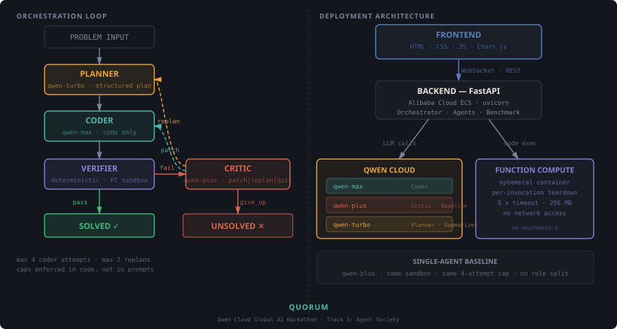

# Quorum

**Multi-agent competitive programming solver — Qwen Cloud Global AI Hackathon, Track 3: Agent Society**

Quorum solves competitive programming problems through role-based agent collaboration (Planner / Coder / Verifier / Critic) and benchmarks itself head-to-head against a single-agent baseline under identical conditions.



---

## What it does

1. **Planner** decomposes the problem into a structured plan (approach, edge cases, complexity target)
2. **Coder** implements the plan — code only, no prose
3. **Verifier** runs the code against tests in an isolated sandbox (Alibaba Cloud Function Compute)
4. **Critic** reviews failures and decides: `patch` the code, `replan` from scratch, or `give_up`

The loop runs until the tests pass or the hard caps are hit (max 4 Coder attempts, max 2 replans — enforced in code).

A single-agent baseline (`qwen-plus`, same sandbox, same cap) runs on the same problem set for a fair comparison.

---

## Quick start

```bash
# 1. Clone and install
git clone https://github.com/bolajiev/Quorum && cd Quorum/backend
pip install -r requirements.txt

# 2. Configure
cp ../.env.example ../.env
# Edit .env: set QWEN_API_KEY and QWEN_BASE_URL

# 3. Run pre-cached benchmark sweep
PYTHONPATH=. python3 -m app.benchmark.runner

# 4. Start the server
PYTHONPATH=. python3 -m uvicorn app.main:app --host 0.0.0.0 --port 8000

# 5. Open http://localhost:8000
```

---

## Tech stack

| Layer | Technology |
|---|---|
| Backend | Python 3.11, FastAPI, uvicorn, WebSockets |
| LLM | Qwen Cloud (qwen-max · qwen-plus · qwen-turbo) via OpenAI-compatible API |
| Sandbox | Alibaba Cloud Function Compute (production) · subprocess ulimit (dev) |
| Frontend | HTML/CSS/JS, Chart.js (CDN) — no build step |
| Deployment | Alibaba Cloud ECS (backend + frontend) + Function Compute (sandbox) |

---

## Deploy to Alibaba Cloud

```bash
# Deploy backend to ECS
ECS_HOST=<your-ecs-ip> bash infra/deploy_ecs.sh

# Deploy FC sandbox
bash infra/deploy_fc.sh
# Then add FC_ENDPOINT and FC_FUNCTION_NAME to .env
```

See [ARCHITECTURE.md](ARCHITECTURE.md) for the full system diagram and design writeup.

---

## Submission

- **Track**: Agent Society (Track 3)
- **Hackathon**: Qwen Cloud Global AI Hackathon
- **License**: MIT — see [LICENSE](LICENSE)
- Built from scratch during the submission period

## License

MIT — see [LICENSE](LICENSE)
